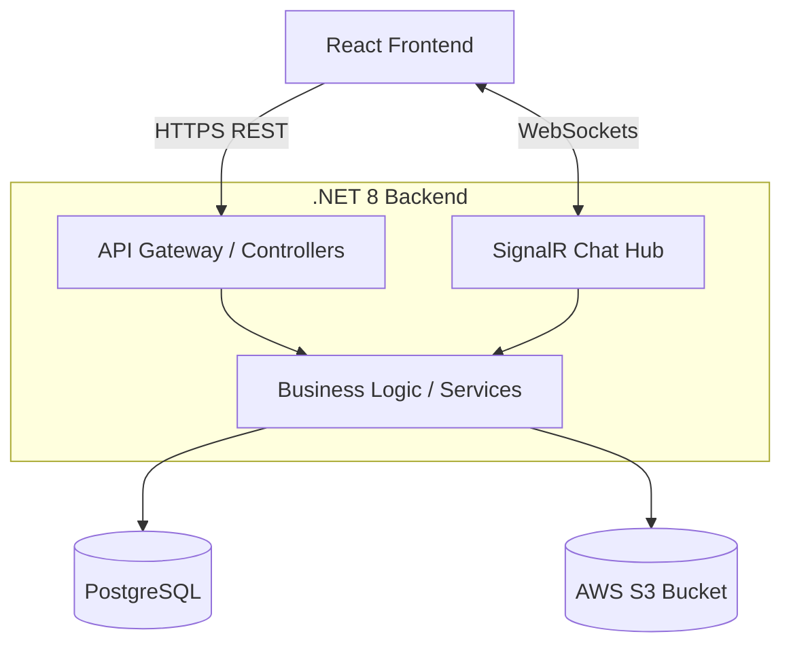

# Full-Stack Microservices Chat Application

A robust, real-time chat application built with a modern stack featuring a .NET 8 backend, a React frontend, and PostgreSQL for data persistence. It supports 1-on-1 chats, group chats, real-time messaging via SignalR, and rich media (photos/videos) shared through AWS S3.

## 🏗 Tech Stack
- **Backend:** .NET 8 C# (Clean Architecture, EF Core, SignalR)
- **Frontend:** React (Vite), Vanilla CSS (Glassmorphism design)
- **Database:** PostgreSQL
- **Storage:** AWS S3 (Presigned URLs for media)

## 📐 High-Level Architecture



The application follows a **Clean Architecture** approach:
1. **API Layer**: Handles incoming HTTP requests and WebSocket connections (SignalR) for real-time messaging.
2. **Core Layer**: Defines domain entities (Users, Chats, Messages) and interfaces (IRepository, IUnitOfWork, IS3Service).
3. **Infrastructure Layer**: Implements the generic repository pattern using Entity Framework Core, handles JWT authentication, and integrates with AWS S3 for media storage (generating presigned URLs).

## ⚙️ Configuration & Setup

### Prerequisites
- .NET 8 SDK
- Node.js (v18+)
- PostgreSQL installed and running locally
- AWS Account with an S3 bucket configured

### 1. Database Configuration
By default, the backend expects a local PostgreSQL instance. Update your connection string inside `ChatApp.Api/appsettings.json`:
```json
"ConnectionStrings": {
  "DefaultConnection": "Host=localhost;Database=ChatAppDb;Username=postgres;Password=your_password"
}
```
*Note: The database and schema will be automatically created on the first run.*

### 2. AWS S3 Configuration
To enable media uploads (photos, videos), add your AWS credentials to `ChatApp.Api/appsettings.json`:
```json
"AWS": {
  "Profile": "default",
  "Region": "us-east-1",
  "BucketName": "your-s3-bucket-name"
}
```

## 🚀 Running the Application

**Run the Backend (API):**
```bash
cd ChatApp.Api
dotnet run
```
The API will start at `http://localhost:5062` (Swagger UI available at `/swagger`).

**Run the Frontend (React):**
```bash
cd frontend
npm install
npm run dev
```
The frontend will start at `http://localhost:5173`.

## 🔐 Default Pre-Seeded Accounts
The database automatically seeds the following accounts on the very first startup. You can use these to test the application immediately:

| Role  | Username | Email             | Password |
|-------|----------|-------------------|----------|
| Admin | Admin    | admin@example.com | admin123 |
| User  | User One | user1@example.com | user123  |
| User  | Dummy    | dummy@example.com | dummy123 |
